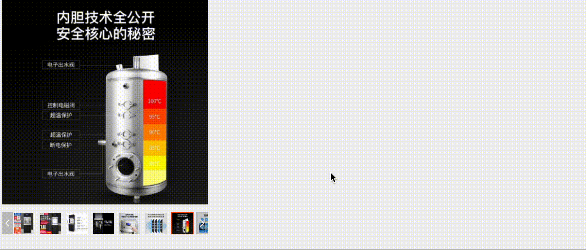

# vue-mirror-scope

## description

[中文文档](./README_zh.md)



`Vue-mirror-scope` is a product picture enlargement for details view components, functions and [Taobao's](https://www.taobao.com) magnifying glass

## install

`npm install --save vue-mirror-scope`

## use

```javascript
    <template>
        <vue-mirror-scope :imgList="imgList"></vue-mirror-scope>
    <template>

    <script>
        import {defineComponent} from Vue
        import VueMirrorScope from "vue-mirror-scope"
        export default defineComponent({
            components:{
                VueMirrorScope
            },
            setup(){
                const imgList = ['./img1.png','img2.png',...]; // and more
            }
        })

    </script>

```

## property document

| property |  value  | explain  |
| :-----:|:------:|:------:|
| imgList | Array[string] | image source list |
| size | String | Magnifying the size of the main image area/zoom area，It is a A square ,`size * size`,(only support `px`) |
| expandScope| Number |  Magnification of pictures at double speed |
